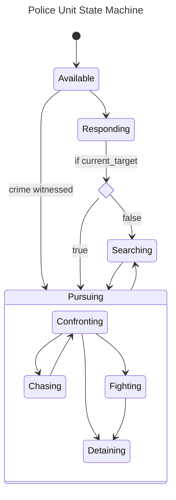

# Population
Handles spawning and tracking of NPCs for a specific purpose, loot tables for world NPCs, and anything else dealing with spawn population.

## Police
Every police local that spawns naturally is automatically tracked by the server. This pool of available officers will be sent to nearby relevant calls by the server-controlled dispatcher system.

Police units use a state machine. The server-side dispatcher system assigns calls which make police units transition from Available to Responding.  From there, the police unit makes decisions on its own. However, the dispatcher may "clear" a police unit from a call which can force an immediate transition back to Available from any state.

Once a police unit enters Responding state, there are only two possibilities. If there are no existing suspects on a call (the default if this is the first responding unit), the responding police unit arrives at the dispatched location and transitions into the Searching state. They will remain here until they're cleared from the call (by the dispatcher) or they identify a suspect (largely based on relationship status between nearby visible peds).

The second option is that the police unit is assigend a `current_target` while in Responding state, prior to arrival at the dispatched location. When this occurs, the police unit immediately transitions into one of the Pursuing states (mostly likely Chasing) depending on distance to target. This second situation occurs frequently when the first arriving police unit identifies a suspect. This information is then relayed to other responding units via the dispatcher system.

